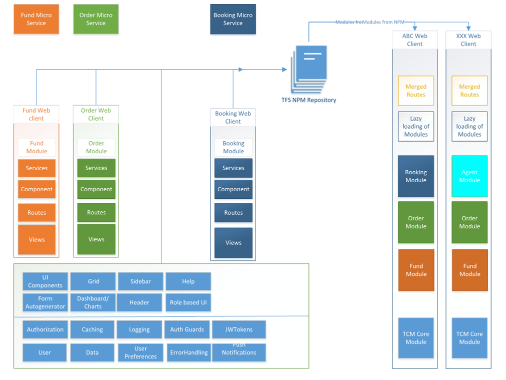

# Modular Architecture

Today’s Web Applications are complex and consist of many isolated functional areas. Having all functionalities in one single web application makes it difficult to maintain, change and develop. You might have large and distributed teams working at remote locations focusing on specific functionality which makes it even harder to maintain one code base.

It’s important to have a good architecture so that we reduce various dependencies when it comes to large teams. Angular provides a way to develop modules, however, having all the modules under same code base makes the maintenance difficult, less readable code and use all or nothing issue.
This architectural solution provides a way to develop and build functional modules independently and then seamlessly integrate them to create a more complex composite web application.

With this architecture, you develop a module, which can be a functional module or a technical shared module, test (Unit teat & user test) it, and create a library. The library is pushed to the private or public repository and referenced by the consumer modules from there. This makes it easy to introduce breaking changes while consumer still uses older working version. 

## Functional Module design
Functional / technical module is designed in such a way that it can be published as a library or can be independently deployable application.
Solution contains a folder structure which resembles - 

    |---Src

        |---app

        |---assets

        |---environments

        |--library

The library is developed under library folder and content is pushed to the repository for consumers. Same library is consumed by the application residing under app folder. So, you develop the library unit test and do end to end test before you publish it to the consumers.

Library is build using gulp workflow, which gives you better control over how library is build and which content you want to bundle with your library.

## Application
Application is container for many functional modules. It does not contain any code however, it consumes the modules configure them, define the routes and provides a deployable application on web servers.

      |---Src

            |---app

            |---assets

            |---environments

            |--library

  
## Integrating Angular appli

 

